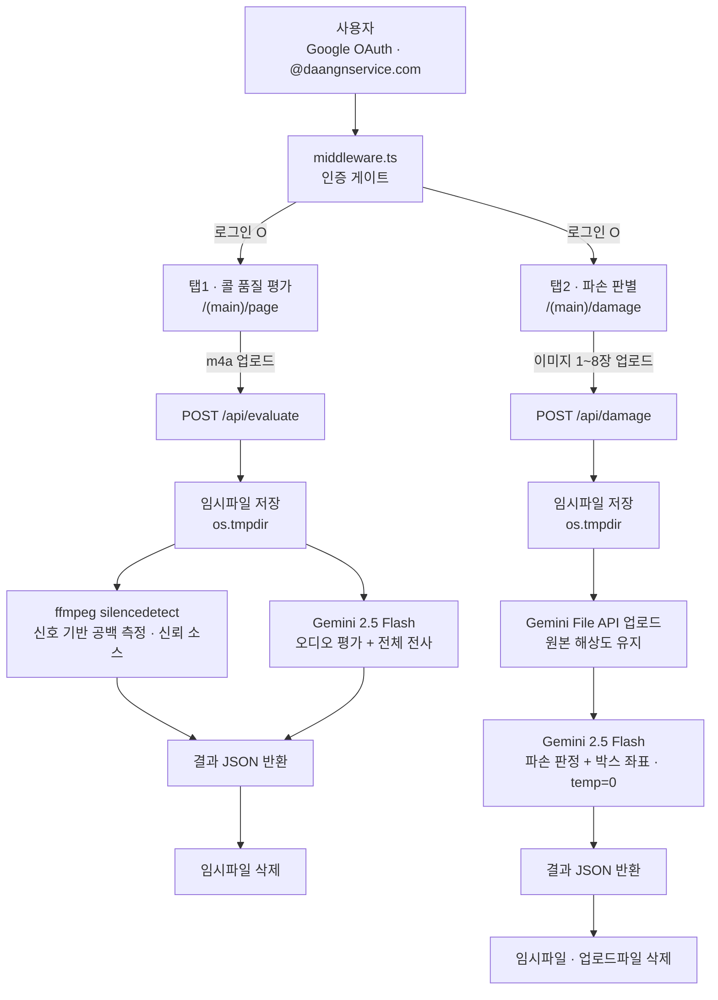

# helpdesk-x 서비스 동작 구조

> Vercel: 프로덕션 `https://call-quality-eval-theta.vercel.app`
> 연결된 git : https://github.com/karla0405/helpdesk-x (+ 조직 미러 https://github.com/daangnservice-com/helpdesk-x, dual-push)
> 한 줄 설명: X팀 전용 **사내 테스트용 AI 도구 사이트**. 구글 SSO 뒤에서 동작하며 사이드바 2탭 구성 — ①CS 콜 녹음 품질 평가(오디오)와 ②상품 사진 파손 판별(Vision). DB 없이 **업로드 → AI 처리 → 결과 반환**의 무상태 동기 파이프라인.

---

## 1. 한눈에 보는 전체 구조



- 핵심은 **DB·상태 저장이 전혀 없는 요청-응답형 구조**. 업로드된 파일은 처리 직후 삭제되고, 결과는 화면에만 표시됨(영구 저장 없음).
- 두 탭 모두 같은 골격: `업로드 → 임시파일 → AI 호출 → JSON 결과 → 임시파일 정리`.
- 콜 평가만 **이중 파이프라인**(ffmpeg 신호분석 + Gemini AI)이고, 파손 판별은 Gemini 단독.

---

## 2. 핵심 기능

| 탭 | 기능 |
|---|---|
| 콜 품질 평가 (`/`) | CS 콜 녹음(`.m4a`) 업로드 → 응대 태도·문제 해결력·대화 흐름 각 1~5점 + 총평 + **초 단위 공백(무음) 타임라인** + **전체 대화 스크립트**(화자·타임스탬프) |
| 파손 판별 (`/damage`) | 상품 사진(`jpg/png/webp`) 1~8장 업로드 → **파손됨/정상/불확실** + 신뢰도(%) + 파손 근거(부위·유형·설명) + **사진 위 빨간 박스 오버레이**(중고거래 반품/분쟁용) |

- **공백 기준**: 기본 3초 이상, 화면 슬라이더로 1~10초 조절 (`minSilenceSec`).
- **박스 오버레이**: 각 근거에 `photoIndex` + 정규화 바운딩 박스(0~1000) → 원본 사진 위 번호(①②③) 사각형, 근거 리스트와 hover 연동.
- **관리자/권한 구분 없음**: 로그인만 통과하면 두 탭 모두 동일하게 사용(내부 테스트 도구).

---

## 3. 기술 스택

| 분류 | 기술 |
|---|---|
| 프레임워크 | Next.js 15 (App Router) / TypeScript / Tailwind CSS v4 (`@theme`, CSS-first) |
| 인증 | NextAuth.js v4 (Google OAuth, `signIn` 콜백에서 `@daangnservice.com` 도메인 제한) |
| AI | Google `gemini-2.5-flash` (`@google/generative-ai`) — 오디오·이미지 모두 **File API** 업로드 |
| 무음 감지 | `ffmpeg-static`의 `silencedetect` 필터 (신호 기반, 자식 프로세스 spawn) |
| 임시 저장 | OS 임시 디렉토리(`os.tmpdir()`) — 처리 후 즉시 삭제, **영구 저장소 없음** |
| 모니터링 | `@vercel/analytics` (루트 레이아웃, 배포 시 자동 수집) |
| 테스트 | Vitest (+ @testing-library/react) |
| DB | **없음** (무상태) |

---

## 4. 인증 구조

```
브라우저 접속
    │
middleware.ts — NextAuth(withAuth) 세션 확인
    ├─ 세션 없음 → /login (구글 로그인 버튼만)
    └─ 세션 있음 → 메인 앱 (사이드바 셸)
                       │
        signIn 콜백에서 이메일 도메인 검증
        └─ @daangnservice.com 아니면 로그인 거부
```

- `matcher`가 `/api/auth`, `/login`, `/_next/static`, `/_next/image`, `favicon.ico`, `icon.png`, `robots.txt`를 **제외한 모든 경로를 보호** → 미로그인 시 `/login`으로 리다이렉트.
- 도메인 검증은 `lib/auth.ts`의 `isAllowedEmail()` 한 곳에서 처리 (`ALLOWED_EMAIL_DOMAIN`, 기본 `daangnservice.com`).
- 관리자/등급 개념 없음 — 통과 = 전체 기능 사용.
- **SEO 차단**: 루트 메타 `noindex, nofollow` + `/robots.txt` 전체 Disallow → 외부 검색 노출 안 됨.
- ⚠️ OAuth 값 미설정 시 로컬에서도 `/login`에서 못 넘어감. 프리뷰 배포 URL은 리디렉션 URI 미등록이라 **프로덕션 도메인에서만 로그인 가능**.

---

## 5. 데이터 흐름 상세

### 5-1. 콜 품질 평가 (`POST /api/evaluate`)
1. 클라이언트가 `.m4a` 파일 + `minSilenceSec`(1~10, clamp)을 `FormData`로 전송
2. 서버 검증: 확장자 `.m4a`, 크기 ≤ `MAX_UPLOAD_MB`(기본 200MB)
3. 바이트를 `os.tmpdir()`에 임시파일로 저장(`cqe-...m4a`)
4. **ffmpeg `silencedetect`** 실행(`noise=SILENCE_NOISE_DB(-30)dB : d=minSilenceSec`) → 전체 길이·무음 구간 파싱, 요약(횟수/총합/최장/비율) 산출 — **신뢰 소스**
5. **Gemini 2.5 Flash**: File API로 오디오 업로드 → `ACTIVE` 대기(최대 120초 폴링) → 4번 공백 데이터를 프롬프트에 동봉해 태도/해결력/흐름 점수 + 총평 + 공백 코멘트 + **전체 전사**(화자·`atSec`) 생성, 응답은 JSON 스키마 강제
6. **AI가 실패해도** ffmpeg 공백 결과는 유지(`error` 필드에 사유, 점수 0으로 반환)
7. 결과 JSON 반환 후 임시파일·Gemini 업로드파일 삭제(`finally`)

> 공백 타임라인은 ffmpeg 신호 기반이라 초 단위로 정확, 전사 타임스탬프는 Gemini 추정치라 근사값.

### 5-2. 파손 판별 (`POST /api/damage`)
1. 클라이언트가 이미지 여러 장을 `images`로 전송
2. 서버 검증: 장수 ≤ `MAX_IMAGES`(기본 8), 확장자 jpg/jpeg/png/webp, 장당 ≤ `MAX_IMAGE_MB`(기본 10MB)
3. 각 이미지를 임시파일 저장 → **Gemini File API 업로드**(원본 해상도 유지 → 미세 손상까지) → `ACTIVE` 대기(장당 최대 30초 폴링)
4. **한 번의 Gemini 호출**에 모든 사진 + 프롬프트 동봉, `temperature=0`(좌표 안정성) → 종합 판정(verdict/confidence/summary) + 근거(location·type·description·`photoIndex`·정규화 박스) + 사진별 코멘트
5. 판정 규칙: 위치 특정 불가 시 박스는 `null`(부정확한 박스보다 없음이 나음), verdict는 화이트리스트 검증(벗어나면 '불확실')
6. 결과 JSON 반환 후 임시파일·업로드파일 모두 삭제(`finally`)

> HEIC 미지원(1단계) — 아이폰 기본 HEIC는 Gemini가 직접 못 받아 제외.

### 5-3. 처리 실행 환경
- 두 API 모두 `runtime = "nodejs"`, `maxDuration = 60`.
- 로컬 `next dev`는 크기/시간 무제한 → 30분 파일도 동작.
- Vercel(Hobby)은 **요청 본문 4.5MB · 실행 60초 제한** → 긴 파일/대용량 업로드는 실패 가능 → 2단계에서 해소.

---

## 6. 결과 데이터 구조 (영구 저장 없음, 응답 전용)

### `EvaluationResult` — 콜 품질 평가 응답
- `durationSec`, `threshold{minSilenceSec, noiseDb}`, `silences[]`(startSec/endSec/durationSec), `silenceSummary{count,totalSec,longestSec,silenceRatio}`
- `evaluation.scores{attitude, resolution, flow}`(각 score 1~5 + comment), `overallSummary`, `silenceComments[]`(atSec/note), `transcript[]`(atSec/speaker/text), `error`(AI 실패 사유 or null)

### `DamageResult` — 파손 판별 응답
- `verdict`(파손됨/정상/불확실), `confidence`(0~1), `summary`
- `findings[]`(location·type·description·photoIndex·box{ymin,xmin,ymax,xmax|null}), `perPhoto[]`(index/note)

> `lib/*` 처리 모듈은 `next`/HTTP에 의존하지 않는 순수 함수 → 그대로 테스트·이식 가능(2단계 Lambda 이식 대비).

---

## 7. 외부 연동 요약

| 연동 | 방향 | 용도 |
|---|---|---|
| Google OAuth | 인바운드 (로그인) | 사내 계정 인증(@daangnservice.com) |
| Gemini File API | 아웃바운드 | 오디오·이미지 업로드(원본 해상도) |
| Gemini `2.5-flash` | 아웃바운드 | 콜 품질 평가·전사 / 파손 판정·박스 좌표 |
| ffmpeg-static | 로컬 프로세스 | 무음 구간 신호 분석(silencedetect) |
| Vercel Analytics | 아웃바운드 | 방문/사용 지표 수집 |

- **DB·BigQuery·Supabase·Slack·Notion 연동 없음** (helpdesk-integrated와의 가장 큰 차이 — 무상태 단독 앱).

---

## 8. 참고: 환경변수 / 로컬·배포 명령

**주요 환경변수** (`.env.local` + Vercel 프로젝트 양쪽)

| 변수 | 용도 | 기본값 |
|---|---|---|
| `GEMINI_API_KEY` (필수) | Gemini 호출 키 | — |
| `GEMINI_MODEL` | 모델명 | `gemini-2.5-flash` |
| `GOOGLE_CLIENT_ID` / `GOOGLE_CLIENT_SECRET` (필수) | 구글 OAuth | — |
| `NEXTAUTH_SECRET` (필수) / `NEXTAUTH_URL` | 세션 서명 / 서비스 URL | `openssl rand -base64 32` / 배포 도메인 |
| `ALLOWED_EMAIL_DOMAIN` | 로그인 허용 도메인 | `daangnservice.com` |
| `SILENCE_NOISE_DB` | 무음 dB 임계 | `-30` |
| `MAX_UPLOAD_MB` | 콜 녹음 최대 | `200` |
| `MAX_IMAGES` / `MAX_IMAGE_MB` | 파손 최대 장수 / 장당 최대 | `8` / `10` |

```bash
npm install          # .npmrc(legacy-peer-deps=true) 포함
npm run dev          # 로컬 개발 서버 → 구글 로그인 → 사용
npm test             # Vitest
npm run build        # 프로덕션 빌드
vercel deploy --prod # 배포 (환경변수·OAuth 리디렉션 URI에 배포 도메인 등록 필요)
```

---

## 9. 상태 / 로드맵

- **1단계 (완료)**: 두 탭(콜 품질 평가·파손 판별) + 박스 오버레이 + 구글 SSO + 외부 검색 차단 + Vercel Analytics. **AWS 없이 Next.js 단독 동기 처리**.
- **2단계 (예정, 인프라 협의 후)**: S3 presigned 업로드 + AWS Lambda 비동기 처리(대용량·장시간 대응, Vercel 4.5MB/60초 한계 해소).
- **후속 개선**: 파손 박스 정확도 B(부위별 재검출)/C(`gemini-2.5-pro`), 필요 시 HEIC 지원.
