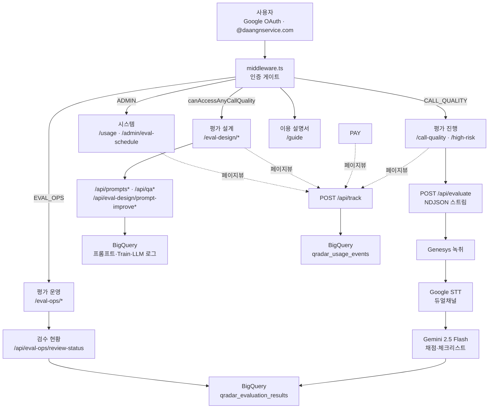

# helpdesk-x (QRadar) 서비스 동작 구조

> QMS 평가 설계 IA·화면 매핑: [docs/qms/00-overview.md](qms/00-overview.md)  
> 팀/접속 안내: [헬프데스크-접속-안내.md](헬프데스크-접속-안내.md)

> **프로덕션**: `https://helpdesk-x.daangnservice.com` (PAB 내부 EC2 · Docker `output: standalone` · ALB)  
> **git**: https://github.com/karla0405/helpdesk-x (+ 조직 미러 https://github.com/daangnservice-com/helpdesk-x)  
> 한 줄 설명: 당근서비스 **콜 품질 평가(QRadar)** — Google SSO 뒤, 이메일 화이트리스트로 탭·API를 게이트한다. Genesys 녹취 → Google STT → Gemini 판정, 결과는 BigQuery에 영구 저장. 평가 설계(QMS IA)로 평가표·정확도·프롬프트 개선을 운영한다.

---

## 1. 한눈에 보는 전체 구조



- **콜 분석**은 상주 프로세스(Genesys + STT 장시간)라 Vercel 서버리스가 아니라 **EC2 Docker**로 운영한다.
- **상태 저장**: 평가 결과·프롬프트 버전·LLM/STT 로그·사용량 모두 BigQuery(`data-proj-470202`, `BQ_TARGET`로 `ds_qradar_dev` / `ds_qradar_prod`). 오디오는 영구 저장하지 않는다.
- 레거시 파손 판별(`/damage`)·m4a 직접 업로드 UX는 **제거됨**.

---

## 2. 화면·권한 (사이드바)

| 그룹 | 탭 | 라우트 | 게이트 |
|---|---|---|---|
| **평가 진행** | 전체 평가 | `/call-quality` | `CALL_QUALITY_EMAILS` |
| | 고위험군 평가 | `/call-quality/high-risk` | 동일 (고위험군 필터 ON) |
| (딥링크) | 결과 공유 | `/call-quality/result/[id]` | 저장본 `analysis_id` |
| **평가 운영** | 평가 스케줄 | `/eval-ops/schedule` | 로그인 |
| | 평가 배분 | `/eval-ops/assign` | `canAccessEvalOps` |
| | └ 확정 배분 | `/eval-ops/assign?tab=assign&confirmed=1` | 동일 |
| | 자동 평가 실행 | `/eval-ops/auto-run` | `canAccessEvalOps` (초안 UI) |
| | 검수 현황 | `/eval-ops/review-status` | `CALL_QUALITY_EMAILS` |
| 평가 설계 | 평가표 … AI 호출 사용량 | `/eval-design/*` | `canAccessAnyCallQuality` |
| | (하위) AI 평가 항목 | `/eval-design/ai-items` | 평가 항목 아래 중첩 |
| 품질평가 | 리포트·현황·케이스·집계 | `/results/*` | `canAccessAnyCallQuality` |
| 시스템 | 사용량 | `/usage` | `ADMIN_EMAILS` |
| 시스템 | AI 평가 job | `/admin/eval-schedule` | `ADMIN_EMAILS` |
| 도움말 | 이용 설명서 | `/guide` | 로그인만 |

- 홈(`/`)은 권한에 따라 `/call-quality` → `/usage` 순으로 리다이렉트. 권한 없으면 안내 문구.
- 레거시: `/prompts` → `/eval-design/sheets`, `/qa` → `/eval-design/accuracy`.
- 화이트리스트: `lib/adminEmails.ts`.

---

## 3. 핵심 기능

### 3-1. 평가 진행 (전체 / 고위험군)

1. **샘플** — BQ `ds_growth_culture.qradar_evaluation_cases`에서 통화 목록·필터.
2. **녹취** — Genesys OAuth → recording API(단건, 배치 폴백).
3. **STT** — GCS 임시 업로드 → `longRunningRecognize`(듀얼채널 화자분리). 기존 전사 재사용 가능.
4. **공백** — STT 발화 간격(실패 시 ffmpeg `silencedetect`).
5. **Gemini (AI 평가)** — CS 체크리스트 중심(검토필요 판정) · 공백/근거 기반 검수 지원.
6. **수기 검수** — STT 위 검토필요/최종 Cold·Hot 정정·추가 → 「검수 완료」로 조회 시 파생.
7. **저장** — 통합 테이블 `qradar_evaluation_results`(조직 구분 컬럼 포함). 공유 URL `/call-quality/result/[id]`.
8. **재생** — `/api/call-quality/audio` WAV 프록시(Range 206, 다운로드 차단). 서버에 오디오 영구 저장 없음.
9. **PII** — 전화·주민·카드·이메일 마스킹(저장·표시 멱등).

UI는 `EvalProgressWorkbench`(3-pane). `/call-quality/high-risk`는 동일 컴포넌트에 `highRiskOnly` 기본값.

### 3-1b. 검수 현황

지정 기간(기본: 당월 KST) 내 **수기 검수 완료**된 `call_eval` 케이스를 집계한다.

- API: `GET /api/eval-ops/review-status`
- 스토어: `lib/reviewStatusStore.ts`
- UI: Accuracy / Recall / Precision KPI · FN→FP · confusion matrix · 평가셋(프롬프트 버전) 비중 · 항목 토글(주로 틀리는 항목 ↔ 항목별 비교) · 케이스 리스트
- 공유 UI: `components/eval-metrics/AccuracyMetricsShared.tsx` (정확도 대시보드와 동일)

### 3-2. 평가 설계 (QMS)

| 화면 | 라우트 | 백엔드 |
|---|---|---|
| 평가표 | `/eval-design/sheets` | `promptStore` · `/api/prompts` |
| 고위험군 플래그 | `/eval-design/high-risk` | `/api/eval-design/high-risk-flags` |
| 평가 항목 | `/eval-design/items` | `criterionStore` source view |
| AI 평가 항목 | `/eval-design/ai-items` | `criterionStore` prompts · `/api/prompts/criteria` |
| 정확도 대시보드 | `/eval-design/accuracy` | `qaStore` · `/api/qa/matrix` · 공유 metrics UI |
| AI 비교·개선 | `/eval-design/compare` | `/api/qa/compare` · `evaluate` |
| 프롬프트 개선 | `/eval-design/prompt-improve` | `/api/eval-design/prompt-improve/*` |
| AI 호출 사용량 | `/eval-design/llm-usage` | `llm_call_logs` · `/api/stats/llm` |

상세: [docs/qms/](qms/00-overview.md).

### 3-3. 시스템

- **사용량** — 페이지뷰 + 기능 사용 집계(`qradar_usage_events`).
- **평가 스케줄** — 프로세스 메모리의 진행 중/최근 평가 job 보드(`lib/evalSchedule.ts`). QMS 회차·배정 UI가 아님. 재시작 시 유실.

---

## 4. 기술 스택

| 분류 | 기술 |
|---|---|
| 프레임워크 | Next.js 15 (App Router, `output: standalone`) / TypeScript / Tailwind CSS v4 / SEED Design |
| 인증 | NextAuth v4 (Google OAuth, `@daangnservice.com`) |
| AI | `gemini-2.5-flash` (`@google/generative-ai`) |
| 음성인식 | Google Cloud Speech-to-Text (듀얼채널) |
| 녹취 | Genesys Cloud recording API |
| 무음 | `ffmpeg-static` (STT 폴백) |
| 저장 | BigQuery · GCS(STT 임시) |
| 배포 | Docker Compose on EC2, ALB `/api/health` |
| 테스트 | Vitest |

---

## 5. 인증·미들웨어

```
브라우저 접속
    │
middleware.ts — NextAuth(withAuth) 세션 확인
    ├─ 세션 없음 → /login
    └─ 세션 있음 → 메인 셸(사이드바)
                       │
        signIn 콜백: isAllowedEmail() (@daangnservice.com)
        탭/API: ADMIN / CALL_QUALITY 화이트리스트 (org=pay는 백엔드 재사용용)
```

- matcher 제외: `/api/auth`, `/api/health`, `/login`, `/_next/*`, `favicon`/`icon`/`robots`.
- SEO: 루트 `noindex,nofollow` + `/robots.txt` Disallow.
- LAN: private IP → nip.io 리다이렉트(Google OAuth가 raw IP Origin 거부).

---

## 6. 데이터 흐름 상세

### 6-1. `POST /api/evaluate`

1. 세션 + org ACL 확인. 동일 `conversationId` 중복 실행은 `evalSchedule.tryStartEvalJob`으로 거부.
2. Genesys에서 미디어 확보 → WAV 변환.
3. STT(또는 저장 전사 재사용) → 공백/겹침 계산.
4. production 프롬프트(`promptStore`) + Gemini 판정.
5. PII 마스킹 후 `evalResultStore.saveEvalResult` (통합 결과 테이블).
6. 클라이언트는 NDJSON 스트림으로 단계 진행을 받음.

> `lib/analysisStore.ts`는 `evalResultStore`의 **deprecated 래퍼**(기존 import 유지). 신규 코드는 `evalResultStore` 직접 사용.

### 6-2. 오디오 재생 `GET /api/call-quality/audio`

재생 시에만 Genesys → WAV → Range 스트리밍. 메모리 단기 캐시. `controlsList=nodownload`.

### 6-3. 사용량 `POST /api/track`

`UsageTracker`가 라우트 변경 시 `sendBeacon`. 로그인 사용자만 BQ 적재, 항상 204(fire-and-forget).

### 6-4. BigQuery 타겟 (`lib/bqRefs.ts`)

| 구분 | 위치 |
|---|---|
| 공유 입력 | `ds_growth_culture` — cases, criteria view, Train references |
| 앱 적재 | `ds_qradar_dev` 또는 `ds_qradar_prod` (`BQ_TARGET`) — results, prompts, usage, llm/stt logs |
| 테이블 접두 | `qradar_` (예: `qradar_evaluation_results`, `qradar_usage_events`) |

평가 데이터는 실행 결과와 차원을 분리한다.
`llm_prompt_versions`가 평가셋 차원이고, `vw_evaluation_criterions`/`llm_criterion_prompts`가
기준 차원이다. `qradar_eval_set_criteria`는 평가셋과 기준의 연결,
`qradar_evaluation_criterion_results`는 실행별 기준 판정(`violated`, `reason`, `evidence`)을 저장한다.
결과 JSON에는 신규 데이터부터 평가셋 정의를 중복 저장하지 않으며, 기존 JSON은 legacy fallback으로 읽는다.

---

## 7. API 목록

| Path | 역할 | 권한 |
|---|---|---|
| `/api/auth/[...nextauth]` | NextAuth | public |
| `/api/health` | ALB 헬스 | public |
| `/api/evaluate` | 콜 평가 실행 | org ACL |
| `/api/call-quality/samples` | 샘플 목록 | org |
| `/api/call-quality/results` | 저장 결과 | org |
| `/api/call-quality/filter-options` | 필터 옵션 | any CQ |
| `/api/call-quality/audio` | 오디오 프록시 | org |
| `/api/call-quality/reviews` · `…/complete` | 리뷰 메모·완료 | org |
| `/api/eval-ops/review-status` | 검수 현황 집계 | call quality |
| `/api/eval-ops/bootstrap` · `assign/*` · `schedule` | 배분·스케줄 | eval ops |
| `/api/prompts` · `/api/prompts/criteria` | 평가표·기준·AI 항목 | any CQ |
| `/api/qa/samples` · `compare` · `evaluate` · `matrix` | Train·비교·정확도 | any CQ |
| `/api/eval-design/prompt-improve/*` | 불일치·프롬프트 초안 | any CQ |
| `/api/stats/llm` | LLM 사용량 | any CQ |
| `/api/stats/usage` | 페이지 사용량 | admin |
| `/api/admin/eval-schedule` | 평가 job 보드 | admin |
| `/api/track` | 사용량 beacon | session |

> UI는 `/eval-design/*`인데 API 일부는 레거시 이름(`/api/prompts`, `/api/qa/*`)을 유지한다. 리다이렉트·문서화로 호환. 네임스페이스 통일은 리팩토링 백로그.

---

## 8. 프로젝트 구조 (요약)

```
app/
  (main)/
    call-quality/          # 전체 평가 · high-risk · result/[id]
    eval-ops/              # schedule · assign · review-status
    eval-design/           # sheets · high-risk · items · ai-items · accuracy · …
    results/               # report · status · cases · aggregate
    admin/eval-schedule/   # 관리자 AI 평가 job 보드
    guide/ · usage/
  api/                     # evaluate · call-quality/* · eval-ops/* · prompts · qa · …
lib/                       # HTTP 비의존 모듈(플랫). bqRefs · evaluate · *Store · reviewStatus* …
components/
  eval-design/ · eval-ops/ · eval-metrics/ · guide/
middleware.ts · Dockerfile · docker-compose.prod.yml
docs/
  helpdesk-x_서비스구조.md  # 본 문서
  qms/                     # 평가 설계 IA·판정 모델·검수 현황
```

---

## 9. 환경변수 (요약)

필수: `GEMINI_API_KEY`, `GOOGLE_CLIENT_ID`/`SECRET`, `NEXTAUTH_SECRET`/`URL`, Genesys·GCP 자격.  
전체 표·로컬 nip.io·배포: [README.md](../README.md) · [.env.local.example](../.env.local.example).

주요 스위치: `BQ_TARGET=dev|prod`, `GROWTH_CULTURE_PROJECT_ID`, `QRADAR_DATASET`, Genesys/STT 관련.

---

## 10. 상태 / 로드맵

**완료**

- 콜 분석(Genesys · STT 듀얼채널 · 공백 · CS 체크리스트 · org 탭 · 결과 저장/공유 · 오디오 임시재생 · PII)
- 평가 설계 1차(평가표·항목·AI 항목·정확도·비교·프롬프트 개선·LLM 사용량)
- 사용량 트래킹 · 관리자 평가 스케줄(인메모리) · 이용 설명서 · SSO · EC2 Docker

**다음**

 - 긴 통화·아카이브 녹취 비동기 복원
- 평가 세션(회차) 전용 UI · QMS 운영(배정·이의제기) 이식
- 당근서비스워크 평가폼 자동기입

**구조 리팩토링 백로그** (동작 변경 없음 목표)

| 우선 | 항목 |
|---|---|
| High | `analysisStore` 호출부를 `evalResultStore`로 치환 후 래퍼 제거 |
| High | `/api/prompts`·`/api/qa` → `/api/eval-design/*` 네임스페이스(임시 redirect) |
| Med | `lib/` 도메인 폴더(`call-quality/`, `eval-design/`, `observability/`) |
| Med | call-quality 컴포넌트를 `components/call-quality/`로 이동 · growth UI 공통화 |
| Med | god 모듈 분할(`evalResultStore`, `promptStore`, workbench UI) |
| Low | package name `call-quality-eval` ↔ 제품명 정렬 · `@vercel/analytics` EC2 적합성 정리 |

---

## 11. 문서 인덱스

| 문서 | 내용 |
|---|---|
| [README.md](../README.md) | 실행·배포·환경변수·비용 |
| [qms/00-overview.md](qms/00-overview.md) | 평가 설계 IA |
| [qms/01-judgment-model.md](qms/01-judgment-model.md) | Hot/Cold 판정 |
| [qms/system/README.md](qms/system/README.md) | 권한·관측 |
| [qms/eval-ops/README.md](qms/eval-ops/README.md) | 평가 운영(요약) |
| `docs/devlog/` | 일자별 개발일지(역사 기록; 현행 구조는 본 문서·README) |
| `docs/superpowers/` | 2026-07 초기 설계 스냅샷(참고용, 현행과 불일치 가능) |
