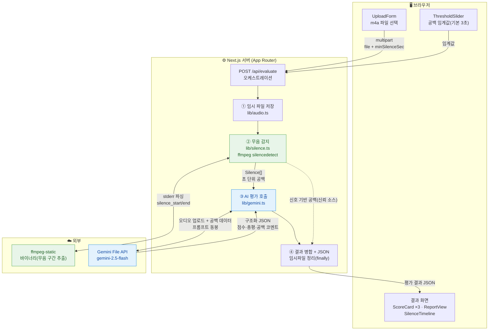

# 통화 품질 평가 테스트 사이트 — 기술 명세서

- **문서 버전**: 1.0
- **작성일**: 2026-07-18
- **프로젝트명**: `call-quality-eval`
- **상태**: 설계 확정 (구현 전)

---

## 1. 목적 / 배경

고객 상담(CS) 콜의 품질을 **사람이 직접 듣지 않고** AI가 대신 평가하기 위한 **테스트용 사이트**.

핵심 검증 목표:

1. **통화 녹음(m4a)만 업로드**하면 AI가 해당 콜의 품질을 평가할 수 있는가?
2. **통화 중 공백(무음 구간)**의 길이를 **초 단위로 정확히** 측정할 수 있는가?
   - 이 공백은 "상담원이 어드민 화면에서 정보를 검색하느라 대화가 비는 시간"을 의미하며, 그 길이를 판단하는 것이 목적.

이 문서는 위 두 가지를 실제로 동작하는 형태(프론트 + 백엔드 + **실제 AI**)로 만들기 위한 설계를 정의한다.

---

## 2. 범위 (Scope)

### 포함
- 통화 녹음 업로드 UI (한 개씩)
- 무음(공백) 구간 신호 기반 정밀 측정
- Gemini 기반 품질 평가 (응대 태도 / 문제 해결력 / 대화 흐름·공백)
- 평가 결과 화면 (항목별 점수 + 총평 + 초 단위 공백 타임라인)

### 제외 (이번 테스트 범위 밖)
- 원본 사이트의 나머지 기능 전부: Q&A / 공지 / 댓글 / 통계 / Slack 연동 / 노션 동기화 / 임베딩·RAG / 검색(Fuse.js) / 문서 분석
- **DB / 영속화** — 결과는 저장하지 않고 화면에만 표시 (새로고침 시 소멸)
- **인증(NextAuth)** — 로컬 테스트용이라 이번엔 제외. 추후 붙이기 쉽게 구조만 열어둠
- 배치 업로드 (여러 개 동시) — 한 번에 한 개만

---

## 3. 기술 스택

| 분류 | 기술 | 비고 |
|------|------|------|
| 프레임워크 | Next.js (App Router) | 원본 스택 준수 |
| 스타일링 | Tailwind CSS v4 (CSS-first, `@theme {}`) | |
| AI (품질 평가) | Google `gemini-2.5-flash`, `@google/generative-ai` SDK | 오디오 직접 입력(multimodal) |
| 무음 감지 | `ffmpeg` (`silencedetect` 필터) + `ffmpeg-static` | 바이너리 npm 동봉, 별도 설치 불필요 |
| 아이콘 | lucide-react | |
| 모니터링 | (제외) | 테스트용 |

**환경변수**
- `GEMINI_API_KEY` — `.env.local`

---

## 4. 입력 사양 (Input)

| 항목 | 값 |
|------|-----|
| 포맷 | `.m4a` (AAC) |
| 통화 길이 | 보통 10~20분, 최대 30분+ |
| 업로드 방식 | 한 번에 한 개 |
| 파일 크기 제한 | 200MB (설정값, 조정 가능) |

- 30분 m4a ≈ Gemini 오디오 토큰 약 6만 토큰 수준 → 컨텍스트 여유 있음. 오디오를 **분할하지 않고 통째로** 처리.

---

## 5. 처리 방식 (Processing Model)

- **동기 처리**: 업로드 → 로딩 스피너 → 결과 표시. 백그라운드 잡/폴링 없음.
- 실행 환경: **지금은 로컬(맥)**, 추후 **사내 AWS(장기 실행 서버, 서버리스 아님)**.
  - 장기 실행 서버라 함수 타임아웃 제약이 없어 동기 처리로 충분히 안전.

---

## 6. 아키텍처

### 6.1 전체 그림 (Mermaid)



- **초록 경로(신호 기반)**: ffmpeg가 무음 구간을 초 단위로 정확히 추출 → 공백 타임라인의 **신뢰 소스**.
- **파랑 경로(AI)**: Gemini가 오디오를 직접 듣고 태도/해결력/흐름을 평가. ②의 공백 데이터를 프롬프트에 동봉받아 **근거 있는 공백 코멘트** 생성.
- ②를 먼저 실행해 그 결과를 ③에 넘기고, 최종 병합 시 공백 수치는 ②(ffmpeg)를 우선한다.

### 6.2 전체 흐름 (텍스트)

```
[브라우저]
  UploadForm (m4a 파일 + 공백 임계값 슬라이더)
      │  multipart/form-data (file, minSilenceSec)
      ▼
[Next.js Route Handler]  POST /api/evaluate
      │
      ├─(1) 임시 파일 저장
      │
      ├─(2) 무음 감지  lib/silence.ts
      │       ffmpeg silencedetect → stderr 파싱
      │       → 임계값(기본 3s) 이상 구간만 필터 → Silence[]
      │
      ├─(3) AI 평가   lib/gemini.ts
      │       Gemini File API 업로드 → gemini-2.5-flash 호출
      │       프롬프트에 (2)의 공백 데이터 동봉
      │       → 구조화 JSON (점수/총평/공백 코멘트)
      │
      ├─(4) 결과 병합 → JSON 응답
      └─(finally) 임시 파일 정리
      ▼
[브라우저]
  ScoreCard × 3 + ReportView(총평) + SilenceTimeline(초 단위)
```

- **(2)를 먼저 실행 → (3)에 공백 데이터를 넘긴다.** 그래야 AI가 "02:15 지점 25초 공백이 대화 흐름을 끊었다"처럼 근거 있는 코멘트를 낼 수 있다.
- ffmpeg 무음 감지는 파일 길이 대비 매우 빠르므로 순차 실행에 따른 지연은 미미하다.

### 6.3 모듈 분리

| 파일 | 책임 | 의존성 | 테스트 |
|------|------|--------|--------|
| `lib/silence.ts` | ffmpeg `silencedetect` 실행, stderr 파싱, 임계값 필터 → `Silence[]` | ffmpeg-static | 파서를 고정 stderr fixture로 단위 테스트 |
| `lib/gemini.ts` | 프롬프트 구성, Gemini File API 업로드/호출, 구조화 응답 파싱 → `Evaluation` | @google/generative-ai | Gemini 호출은 목(mock) |
| `lib/audio.ts` | 임시 파일 저장/정리, 오디오 길이(ffprobe) 계산 | ffmpeg-static | — |
| `lib/types.ts` | 공용 타입 정의 | — | — |
| `app/api/evaluate/route.ts` | 오케스트레이션(1~4) + 예외 처리 | 위 lib들 | — |
| `app/page.tsx` | 업로드 + 결과 화면 (클라이언트 컴포넌트) | components | — |
| `components/UploadForm.tsx` | 파일 선택 + 임계값 슬라이더 + 제출 | — | — |
| `components/ThresholdSlider.tsx` | 공백 최소 길이 슬라이더 (1~10s, 기본 3s) | — | — |
| `components/ScoreCard.tsx` | 항목별 점수/코멘트 카드 | — | — |
| `components/ReportView.tsx` | 총평 텍스트 | — | — |
| `components/SilenceTimeline.tsx` | 공백 타임라인(막대 + 리스트) | — | — |

각 모듈은 단일 책임을 가지며, 내부 구현을 몰라도 입출력 타입만으로 사용 가능하도록 설계한다.

---

## 7. 무음(공백) 감지 상세

### 7.1 방식
`ffmpeg -i <input> -af silencedetect=noise=<dB>:d=<sec> -f null -` 실행 후, **stderr**에 출력되는
`silence_start` / `silence_end` / `silence_duration` 로그를 파싱한다.

### 7.2 파라미터
| 파라미터 | 의미 | 기본값 | 조절 |
|----------|------|--------|------|
| `d` (minSilenceSec) | 이 길이 이상 무음일 때만 공백으로 카운트 | **3초** | 화면 슬라이더(1~10s) |
| `noise` (noiseDb) | 무음으로 볼 음량 상한(dB) | **-30dB** | 이번 버전은 고정(추후 노출 가능) |

- 자연스러운 대화 텀/숨소리는 3초 미만이라 제외되고, "검색성 공백"만 잡힌다.
- 슬라이더로 임계값을 바꿔 여러 번 돌려보며 감을 잡을 수 있게 한다.

### 7.3 산출물
각 공백 구간의 `startSec`, `endSec`, `durationSec` 리스트와 요약(개수/총합/최장/비율)을 계산한다.

---

## 8. AI 평가 상세 (Gemini)

### 8.1 입력
- 오디오: 파일 크기(최대 200MB)를 고려해 **Gemini File API로 업로드 후 참조**(inline base64 대신).
- 프롬프트: 평가 지침 + 항목 정의 + **(7)에서 뽑은 공백 데이터(타임스탬프/길이)**.

### 8.2 평가 항목 (각 1~5점)
| 키 | 항목 | 설명 |
|----|------|------|
| `attitude` | 응대 태도 | 친절함, 공감, 말투 |
| `resolution` | 문제 해결력 | 고객 문의를 실제로 해결했는지 |
| `flow` | 대화 흐름·공백 | 침묵 구간, 어색한 끊김, 대기 시간이 흐름에 준 영향 |

### 8.3 출력 (구조화 JSON 강제)
Gemini의 JSON 응답 스키마를 지정하여 파싱 안정성을 확보한다.

```jsonc
{
  "durationSec": 1234,
  "threshold": { "minSilenceSec": 3, "noiseDb": -30 },
  "silences": [
    { "startSec": 135.2, "endSec": 160.4, "durationSec": 25.2 }
  ],
  "silenceSummary": {
    "count": 4,
    "totalSec": 63.5,
    "longestSec": 25.2,
    "silenceRatio": 0.051   // 총 통화 대비 공백 비율
  },
  "evaluation": {
    "scores": {
      "attitude":   { "score": 4, "comment": "..." },
      "resolution": { "score": 3, "comment": "..." },
      "flow":       { "score": 2, "comment": "..." }
    },
    "overallSummary": "...",
    "silenceComments": [
      { "atSec": 135.2, "note": "02:15 지점 25초 공백으로 고객 대기 발생" }
    ]
  }
}
```

- `silences`, `silenceSummary`, `durationSec`, `threshold`는 **서버(ffmpeg) 산출값**을 신뢰 소스로 사용한다.
- `evaluation`은 **Gemini 산출값**. 공백 코멘트(`silenceComments`)는 서버 공백 데이터를 근거로 AI가 생성.

---

## 9. 결과 화면 (UI)

- **점수 카드 3개**: 태도 / 해결력 / 흐름 (점수 + 코멘트)
- **총평 리포트**: `overallSummary` 텍스트
- **공백 타임라인**:
  - 통화 길이를 가로축으로 한 **막대 시각화**(공백 구간 하이라이트)
  - 아래에 `mm:ss ~ mm:ss (N초)` **리스트** + 해당 공백에 대한 AI 코멘트
  - 요약: 공백 횟수 / 총 공백 시간 / 최장 공백 / 공백 비율
- **임계값 슬라이더**: 상단에 위치, 값 변경 후 재평가 가능

스타일은 Tailwind v4 CSS-first(`@theme {}`) 규칙을 따른다.

---

## 10. 예외 처리

| 상황 | 처리 |
|------|------|
| m4a 아닌 포맷 | 400, "m4a 파일만 지원합니다" |
| 용량 초과(>200MB) | 400, 크기 안내 |
| `GEMINI_API_KEY` 미설정 | 500, 명확한 설정 안내 메시지 |
| ffmpeg 실패 | 500, stderr 요약 포함 |
| **Gemini 실패/타임아웃/레이트리밋** | **공백 타임라인은 살려서 부분 결과 반환** + AI 파트 오류 표시 (테스트 중 무음 측정만이라도 확인 가능) |
| 임시 파일 | 성공/실패 무관하게 `finally`에서 항상 삭제 |

---

## 11. 테스트 전략

- **단위**: `lib/silence.ts` 파서 — 실제 ffmpeg stderr 출력을 캡처한 **고정 fixture**로 파싱/임계값 필터 검증.
- **통합**: 알려진 위치에 인위적 무음을 넣은 **샘플 m4a**로 `/api/evaluate` 동작 확인(공백 타임스탬프 정확도 검증).
- **AI**: Gemini 호출은 테스트에서 **목 처리**. 실제 키로는 수동 스모크 테스트.
- TDD 원칙에 따라 파서·오케스트레이션 로직은 테스트 우선 작성.

---

## 12. 향후 확장 (이번 범위 밖, 참고)

- NextAuth 인증(`@daangnservice.com` 도메인) 부착
- 결과 영속화(BigQuery 등) 및 평가 이력/통계
- 배치 업로드 및 비동기 잡 처리
- `noiseDb` 임계값 UI 노출, 전사(STT) 스크립트 병행 표시
- 사내 AWS 배포(Docker 이미지에 ffmpeg 포함 또는 ffmpeg-static 그대로)

---

## 13. 확정된 결정 사항 요약

1. 범위: 통화 품질 평가 **한 기능만**, 프론트 + 백엔드 + **실제 AI**까지.
2. 입력: m4a, 10~30분+, 한 개씩.
3. 평가 항목: 응대 태도 / 문제 해결력 / 대화 흐름·공백 (각 1~5점).
4. 결과: 항목별 점수 + 총평 + **초 단위 공백 타임라인**.
5. 공백 기준: 기본 3초, 화면 슬라이더로 조절.
6. 아키텍처: **이중 파이프라인** — ffmpeg 신호 기반 공백 측정 + Gemini 오디오 직접 평가, 공백 데이터를 AI 프롬프트에 동봉.
7. 무음 감지: `ffmpeg-static`(바이너리 npm 동봉)로 설치 부담 제거.
8. 처리: 동기, 로컬 실행(추후 사내 AWS 장기 실행 서버).
9. 제외: DB/영속화, 인증, 배치, 원본 사이트의 나머지 기능 전부.
