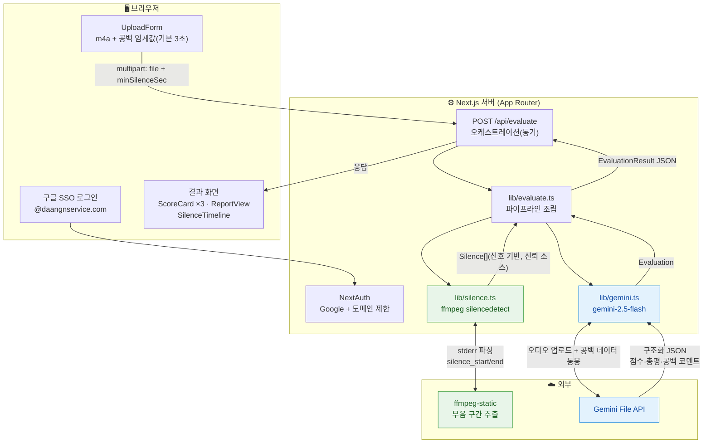

# 통화 품질 평가 테스트 사이트 — 기술 명세서

- **문서 버전**: 3.0
- **작성일**: 2026-07-18
- **개정 이력**: v1.0(로컬 동기) → v2.0(Vercel+S3+Lambda 비동기) → **v3.0(1단계: AWS 없이 동기 처리, AWS는 2단계로 보류)**
- **프로젝트명**: `call-quality-eval`
- **상태**: 설계 확정 (구현 전)

---

## 1. 목적 / 배경

고객 상담(CS) 콜의 품질을 **사람이 직접 듣지 않고** AI가 대신 평가하기 위한 **테스트용 사이트**. 주로 X팀이 기능을 개발한 뒤 이 사이트에서 테스트한다.

핵심 검증 목표:

1. **통화 녹음(m4a)만 업로드**하면 AI가 해당 콜의 품질을 평가할 수 있는가?
2. **통화 중 공백(무음 구간)**의 길이를 **초 단위로 정확히** 측정할 수 있는가?
   - 이 공백은 "상담원이 어드민 화면에서 정보를 검색하느라 대화가 비는 시간"을 의미하며, 그 길이를 판단하는 것이 목적.

---

## 2. 단계 구분 (중요)

| 단계 | 내용 | 상태 |
|------|------|------|
| **1단계 (본 문서 범위)** | **AWS 없이** Next.js 단독. 업로드 → 동기 처리(ffmpeg + Gemini) → 결과. 구글 SSO 포함. | **지금 구현** |
| 2단계 (추후) | 업로드 S3 presigned + 무거운 처리 AWS Lambda(비동기·폴링)로 이전. Vercel Hobby 배포 제약(4.5MB/60초) 우회. | 인프라실 협의 후 |

**설계 원칙**: 무거운 처리 로직(무음 감지·AI 평가·병합)을 **순수 함수 모듈로 격리**하여, 2단계에서 Lambda로 **로직 변경 없이 이식**할 수 있게 한다.

### 배포/실행 환경 참고
- **로컬(`next dev`)**: 일반 Node 서버라 요청 본문/실행시간 제한 **없음** → 30분 파일도 동기 처리로 완전 동작. **1단계 주 테스트 환경**.
- **Vercel 배포(Hobby)**: 서버리스 함수라 요청 본문 4.5MB·실행 60초 제한 → 긴 파일은 타임아웃 가능. 이 제약 해소가 곧 2단계(S3+Lambda)의 목적. 1단계에서 Vercel에 올릴 경우 **짧은 파일 위주로만** 정상 동작(알려진 한계).

---

## 3. 범위 (Scope)

### 포함 (1단계)
- **구글 SSO 로그인** (`@daangnservice.com` 도메인 제한)
- 통화 녹음 업로드 UI (한 개씩)
- 무음(공백) 구간 신호 기반 정밀 측정 (초 단위)
- Gemini 기반 품질 평가 (응대 태도 / 문제 해결력 / 대화 흐름·공백)
- **동기 처리** → 결과 화면 (항목별 점수 + 총평 + 공백 타임라인)

### 제외
- **AWS(S3·Lambda) 일체** → 2단계
- 관계형 DB / 영속화 (결과는 화면에만 표시, 새로고침 시 소멸)
- 배치 업로드
- 원본 사이트의 나머지 기능 전부(Q&A/공지/댓글/통계/Slack/노션/임베딩·RAG/검색/문서분석)

---

## 4. 기술 스택

| 분류 | 기술 | 비고 |
|------|------|------|
| 프레임워크 | Next.js (App Router) | |
| 스타일링 | Tailwind CSS v4 (CSS-first, `@theme {}`) | |
| 인증 | NextAuth.js v4 (Google OAuth) | `@daangnservice.com` 도메인 제한 |
| 무음 감지 | `ffmpeg` (`silencedetect`) + `ffmpeg-static` | 바이너리 npm 동봉, 별도 설치 불필요 |
| AI (품질 평가) | Google `gemini-2.5-flash`, `@google/generative-ai` | 오디오 직접 입력(multimodal) |
| 아이콘 | lucide-react | |
| 언어 | TypeScript | |

**환경변수(`.env.local`)**
- `GOOGLE_CLIENT_ID`, `GOOGLE_CLIENT_SECRET`, `NEXTAUTH_SECRET`, `NEXTAUTH_URL`
- `ALLOWED_EMAIL_DOMAIN=daangnservice.com`
- `GEMINI_API_KEY`, `GEMINI_MODEL=gemini-2.5-flash`
- `SILENCE_NOISE_DB=-30`
- `MAX_UPLOAD_MB=200`

---

## 5. 입력 사양 (Input)

| 항목 | 값 |
|------|-----|
| 포맷 | `.m4a` (AAC) |
| 통화 길이 | 보통 10~20분, 최대 30분+ |
| 업로드 방식 | 한 번에 한 개, `multipart/form-data`로 `/api/evaluate`에 직접 전송 |
| 파일 크기 제한 | 200MB (`MAX_UPLOAD_MB`, 서버에서 검증) |

---

## 6. 처리 방식 (Processing Model)

- **동기 처리**: 업로드 → 로딩 → 결과. 백그라운드 잡/폴링 없음.
- 1요청 안에서: 임시 저장 → ffmpeg 무음 감지 → Gemini 평가 → 병합 → JSON 응답 → 임시파일 정리.

---

## 7. 아키텍처

### 7.1 전체 그림 (Mermaid)



- 🟢 **초록(신호 기반)**: ffmpeg가 무음 구간을 초 단위로 추출 → 공백 타임라인 **신뢰 소스**.
- 🔵 **파랑(AI)**: Gemini가 오디오 직접 평가. `lib/silence.ts` 결과를 프롬프트에 동봉해 **근거 있는 공백 코멘트** 생성.
- **`lib/silence.ts`·`lib/gemini.ts`·`lib/evaluate.ts`는 요청/HTTP에 의존하지 않는 순수 모듈** → 2단계 Lambda 이식 대상.

### 7.2 처리 순서 (텍스트)

1. 로그인(구글 SSO, 도메인 검증) → 업로드 페이지.
2. m4a + 공백 임계값 → `POST /api/evaluate` (multipart).
3. 업로드 파일을 임시 파일로 저장(`lib/audio.ts`).
4. `lib/evaluate.ts`: `runSilenceDetection` → 그 결과를 `runGeminiEvaluation`에 전달 → 병합.
5. `EvaluationResult` JSON 반환, `finally`에서 임시파일 정리.
6. 프론트: 점수 카드 + 총평 + 공백 타임라인 렌더.

### 7.3 모듈 분리

| 파일 | 책임 | HTTP 의존 | 2단계 이식 |
|------|------|:---:|:---:|
| `lib/types.ts` | 공용 타입(`Silence`, `Evaluation`, `EvaluationResult` 등) | ✗ | ○ |
| `lib/audio.ts` | 임시 파일 저장/정리, 오디오 길이(ffprobe) | ✗ | ○ |
| `lib/silence.ts` | ffmpeg `silencedetect` 실행 + stderr 파싱 + 임계값 필터 → `Silence[]` | ✗ | ○ |
| `lib/gemini.ts` | 프롬프트 구성 + Gemini File API 업로드/호출 + 구조화 파싱 → `Evaluation` | ✗ | ○ |
| `lib/evaluate.ts` | 위 모듈 조립(무음 → AI → 병합) → `EvaluationResult` | ✗ | ○ |
| `lib/auth.ts` | NextAuth 설정(Google + 도메인 검증 콜백) | — | 앱 전용 |
| `middleware.ts` | 미인증 접근 차단 | — | 앱 전용 |
| `app/api/evaluate/route.ts` | multipart 파싱 + 검증 + `lib/evaluate.ts` 호출 + 에러 응답 | ○ | 앱 전용(얇게) |
| `app/page.tsx` | 업로드/로딩/결과 화면(클라이언트) | — | 앱 전용 |
| `components/*` | UploadForm, ThresholdSlider, ScoreCard, ReportView, SilenceTimeline | — | 앱 전용 |

- **핵심**: `route.ts`는 "HTTP 껍데기"만 담당하고 실제 처리는 `lib/evaluate.ts`가 한다. 2단계에서 Lambda handler가 이 lib를 그대로 호출.

---

## 8. 무음(공백) 감지 상세

### 8.1 방식
`ffmpeg -i <input> -af silencedetect=noise=<dB>:d=<sec> -f null -` 실행 후 **stderr**의
`silence_start` / `silence_end` / `silence_duration` 로그를 파싱한다.

### 8.2 파라미터
| 파라미터 | 의미 | 기본값 | 조절 |
|----------|------|--------|------|
| `d` (minSilenceSec) | 이 길이 이상 무음일 때만 공백으로 카운트 | **3초** | 화면 슬라이더(1~10s) |
| `noise` (noiseDb) | 무음으로 볼 음량 상한(dB) | **-30dB** | `SILENCE_NOISE_DB` 고정(추후 노출) |

### 8.3 산출물
각 공백 구간 `startSec`/`endSec`/`durationSec` 리스트 + 요약(개수/총합/최장/비율).

---

## 9. AI 평가 상세 (Gemini)

### 9.1 입력
- 오디오: Gemini **File API 업로드 후 참조**.
- 프롬프트: 평가 지침 + 항목 정의 + **(8)에서 뽑은 공백 데이터(타임스탬프/길이)**.

### 9.2 평가 항목 (각 1~5점)
| 키 | 항목 | 설명 |
|----|------|------|
| `attitude` | 응대 태도 | 친절함, 공감, 말투 |
| `resolution` | 문제 해결력 | 고객 문의를 실제로 해결했는지 |
| `flow` | 대화 흐름·공백 | 침묵 구간·어색한 끊김·대기 시간이 흐름에 준 영향 |

### 9.3 출력 (구조화 JSON — `EvaluationResult`)
```jsonc
{
  "durationSec": 1234,
  "threshold": { "minSilenceSec": 3, "noiseDb": -30 },
  "silences": [ { "startSec": 135.2, "endSec": 160.4, "durationSec": 25.2 } ],
  "silenceSummary": { "count": 4, "totalSec": 63.5, "longestSec": 25.2, "silenceRatio": 0.051 },
  "evaluation": {
    "scores": {
      "attitude":   { "score": 4, "comment": "…" },
      "resolution": { "score": 3, "comment": "…" },
      "flow":       { "score": 2, "comment": "…" }
    },
    "overallSummary": "…",
    "silenceComments": [ { "atSec": 135.2, "note": "02:15 지점 25초 공백으로 고객 대기 발생" } ],
    "error": null
  }
}
```
- `silences`/`silenceSummary`/`durationSec`/`threshold`는 **ffmpeg 산출값(신뢰 소스)**.
- `evaluation`은 **Gemini 산출값**. Gemini 실패 시 `evaluation.error`에 사유를 담고 나머지(공백)는 유지.

---

## 10. 결과 화면 (UI)

- **점수 카드 3개**: 태도 / 해결력 / 흐름 (점수 + 코멘트)
- **총평 리포트**: `overallSummary`
- **공백 타임라인**: 통화 길이 가로축 막대(공백 하이라이트) + `mm:ss ~ mm:ss (N초)` 리스트 + AI 코멘트 + 요약(횟수/총합/최장/비율)
- **진행**: 업로드 → 로딩 스피너 → 결과
- 스타일: Tailwind v4 CSS-first(`@theme {}`).

---

## 11. 인증 (NextAuth)

- Provider: Google OAuth.
- `signIn` 콜백에서 이메일 도메인이 `ALLOWED_EMAIL_DOMAIN`과 일치하는지 검증, 아니면 거부.
- `middleware.ts`로 로그인/`/api/auth` 외 전 경로 보호.

---

## 12. 예외 처리

| 상황 | 처리 |
|------|------|
| 비허용 도메인 로그인 | 로그인 거부 + 안내 |
| m4a 아닌 포맷 / 용량 초과 | 400, 명확한 메시지 |
| `GEMINI_API_KEY` 미설정 | 500, 설정 안내 |
| ffmpeg 실패 | 500, stderr 요약 |
| **Gemini 실패/타임아웃** | **공백 결과는 살려서** 부분 결과(`evaluation.error` 표시) 반환 |
| 임시 파일 | 성공/실패 무관 `finally`에서 항상 삭제 |

---

## 13. 테스트 전략

- **단위**: `lib/silence.ts` 파서 — 실제 ffmpeg stderr fixture로 파싱/임계값 필터 검증.
- **단위**: 도메인 검증 로직(허용/거부).
- **통합**: 알려진 무음이 든 샘플 m4a로 `/api/evaluate` 동작·공백 타임스탬프 정확도 확인.
- **AI**: Gemini 호출 목 처리, 실제 키로 수동 스모크.
- TDD: 파서·도메인 검증·병합 로직부터 테스트 우선.

---

## 14. 확정된 결정 사항 요약

1. **1단계 = AWS 없이** Next.js 단독 동기 처리. AWS(S3·Lambda)는 **2단계로 보류**(인프라실 협의 후).
2. 범위: 통화 품질 평가 + **구글 SSO(@daangnservice.com)**.
3. 입력: m4a, 10~30분+, 한 개씩, `/api/evaluate` 직접 업로드.
4. 평가 항목: 태도 / 해결력 / 흐름 (각 1~5점).
5. 결과: 항목별 점수 + 총평 + **초 단위 공백 타임라인**.
6. 공백 기준: 기본 3초, 화면 슬라이더 조절.
7. 아키텍처: ffmpeg 신호 기반 공백(신뢰 소스) + Gemini 오디오 직접 평가, 공백 데이터 프롬프트 동봉.
8. **처리 로직을 순수 모듈로 격리** → 2단계 Lambda 무변경 이식.
9. 무음 감지: `ffmpeg-static` 동봉.
10. 로컬이 주 테스트 환경(제한 없음). Vercel 배포는 짧은 파일 한정(2단계에서 해소).
