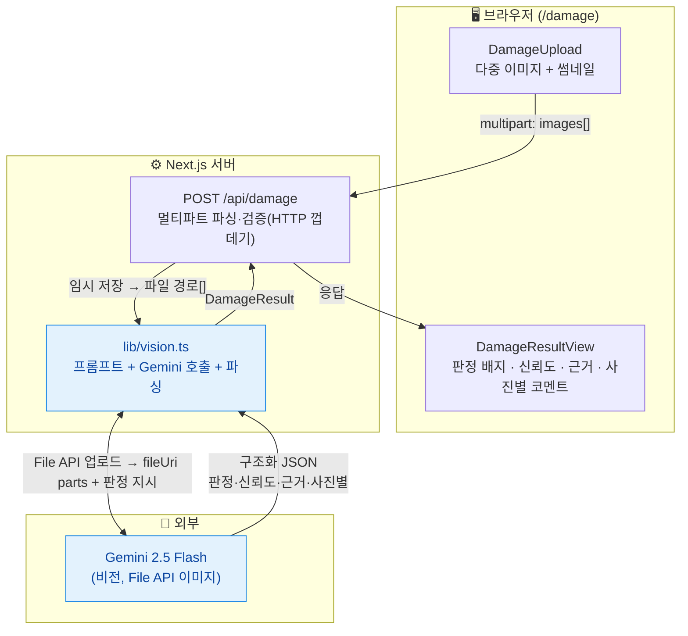

# 파손 상태 자동 판별 (Vision AI) — 기술 명세서

- **문서 버전**: 1.2
- **작성일**: 2026-07-19 (v1.0) / 개정: v1.1(이미지 전송 inline→**File API**) · v1.2(**파손 부위 바운딩 박스 오버레이** 추가 — 원본 사진 위 빨간 박스+번호, 호버 강조)
- **프로젝트**: `call-quality-eval` (기존 앱에 **두 번째 탭**으로 추가)
- **상태**: v1.0~v1.1 구현 완료 / v1.2 설계 확정(구현 전)

---

## 1. 목적 / 배경

상품 사진을 여러 장(1장도 가능) 올리면, **사물 종류와 무관하게** 해당 상품이 파손되었는지 AI(Vision)가 자동 판별하는 기능. 주 용도는 **중고거래 반품/분쟁 판정 근거**로, 사람이 일일이 사진을 뜯어보지 않고 파손 여부·부위·유형을 빠르게 확인하는 것.

기존 "콜 품질 평가" 탭과 같은 앱 안의 **새 탭("파손 판별")**으로 붙인다.

---

## 2. 단계 구분

| 단계 | 내용 | 상태 |
|------|------|------|
| **1단계 (본 문서)** | AWS 없이 Next.js 단독 동기 처리. 이미지 업로드 → Gemini 비전 판정 → 결과. | **지금 구현** |
| 2단계 (추후) | S3 업로드 + 비동기(콜 툴과 공통 인프라), 구글 SSO. | 인프라실 협의 후 |

콜 품질 평가 탭과 동일하게, 처리 로직을 **순수 모듈로 격리**해 2단계 이식을 대비한다.

---

## 3. 범위 (Scope)

### 포함 (1단계)
- 다중 이미지 업로드 (드래그앤드롭 + 파일 선택, 썸네일 미리보기)
- Gemini 비전 기반 파손 판별: **판정 + 신뢰도 + 파손 부위·유형 설명 + 사진별 코멘트**
- **(v1.2) 파손 부위 바운딩 박스 오버레이** — 원본 사진 위에 빨간 박스 + 번호(①②③), 근거 리스트와 번호 매칭, 항목 호버 시 해당 박스 강조
- 동기 처리 → 결과 화면
- 사이드바를 실제 라우팅으로 전환(2탭: 콜 품질 평가 / 파손 판별)

### 제외
- AWS(S3·Lambda), 관계형 DB/영속화, 인증 → 2단계
- HEIC 등 Gemini 미지원 포맷(1단계 제외)
- 심각도 척도(경미/중/심각) — YAGNI, 이번 범위 밖
- 여러 상품 동시 판정(사진마다 다른 건) — 이번엔 "한 상품의 여러 각도"만
- **픽셀 단위 정밀 마스킹(세그멘테이션)** — 바운딩 박스는 Gemini 반환 **근사값**(대략적 부위 가이드). 픽셀 정밀은 별도 모델 필요, 범위 밖

---

## 4. 기술 스택 (기존 앱 재사용)

| 분류 | 기술 | 비고 |
|------|------|------|
| 프레임워크 | Next.js 15 (App Router) | 기존 앱 |
| 스타일링 | Tailwind CSS v4 (CSS-first) | 기존 디자인 언어 |
| AI (비전) | Google `gemini-2.5-flash`, `@google/generative-ai` | 이미지 **File API 업로드 후 참조**(원본 해상도 유지) |
| 아이콘 | lucide-react | |
| 테스트 | Vitest | |

**환경변수**: `GEMINI_API_KEY`, `GEMINI_MODEL=gemini-2.5-flash` (콜 툴과 공유). 추가: `MAX_IMAGES=8`, `MAX_IMAGE_MB=10`.

---

## 5. 입력 사양 (Input)

| 항목 | 값 |
|------|-----|
| 포맷 | `.jpg` / `.jpeg` / `.png` / `.webp` |
| 장수 | 1 ~ **8장** (`MAX_IMAGES`) |
| 크기 | 각 **≤10MB** (`MAX_IMAGE_MB`) |
| 의미 | **한 상품의 여러 각도** → 종합 판정 1개 |
| 업로드 | `multipart/form-data`로 `/api/damage`에 직접 전송 (파일 여러 개) |

---

## 6. 처리 방식

- **동기 처리**: 업로드 → 로딩 → 결과.
- 1요청 안에서: 각 이미지를 임시 저장 → **Gemini File API로 업로드**(원본 해상도) → 업로드된 파일들을 **한 번의 호출로 전부** 참조해 판정 → 구조화 JSON 반환 → 업로드 파일·임시파일 정리.
- **File API를 쓰는 이유**: Gemini는 요청 전체가 20MB를 넘으면 inline 불가인데, 한도가 8장×10MB(최대 80MB)라 inline은 부적합. 또한 원본 해상도를 유지해야 미세한 긁힘/흠집까지 판별 가능(축소 시 정보 손실). 콜 툴의 오디오 File API와 동일 패턴.

---

## 7. 아키텍처

### 7.1 전체 그림 (Mermaid)



- `lib/vision.ts`는 HTTP/Next 비의존 순수 모듈 → 2단계 이식 대상.
- `app/api/damage/route.ts`는 얇은 HTTP 껍데기.

### 7.2 사이드바 라우팅 전환 (기존 코드 개선)

지금은 앱이 단일 페이지(`app/page.tsx` 안에 사이드바 포함)라, 탭이 2개가 되므로 **공통 셸 + 실제 라우팅**으로 정리한다.

- `app/layout.tsx` — `<Sidebar/>` + `<main>{children}</main>` **공통 셸**로 전환(양 페이지 공유).
- `app/page.tsx` — 콜 품질 평가 **본문만** (셸 제거).
- `app/damage/page.tsx` — 파손 판별 **본문**(신규).
- `components/Sidebar.tsx` — 네비 2개(`/` 콜 품질 평가, `/damage` 파손 판별), **`usePathname()`로 활성 표시**(하드코딩 제거).

### 7.3 모듈 분리

| 파일 | 책임 | HTTP 의존 |
|------|------|:---:|
| `lib/types.ts` | (추가) `DamageVerdict`·`DamageFinding`·`PerPhotoNote`·`DamageResult` | ✗ |
| `lib/vision.ts` | `buildDamagePrompt`, `parseDamageResult`, `runDamageDetection` | ✗ |
| `app/api/damage/route.ts` | 멀티파트 파싱·검증·base64 변환·`runDamageDetection` 호출·에러 응답 | ○ |
| `app/damage/page.tsx` | 업로드/로딩/결과 화면(클라이언트) | — |
| `components/damage/DamageUpload.tsx` | 다중 이미지 드롭존 + 썸네일 미리보기 | — |
| `components/damage/DamageResultView.tsx` | 결과 렌더(사진별 오버레이 + 번호 매칭 근거 리스트, 호버 상태) | — |
| `components/damage/AnnotatedImage.tsx` | **(v1.2)** 이미지 1장 + 그 위 빨간 박스/번호 오버레이. `boxToStyle`로 좌표→CSS % 변환 | — |
| `components/damage/VerdictBadge.tsx` | 판정 배지(색상 매핑) | — |
| `components/AppShell` 역할 | `app/layout.tsx`가 담당 | — |

**(v1.2) 좌표 변환 순수 함수** `boxToStyle(box: {ymin,xmin,ymax,xmax}): { left, top, width, height }` — 0~1000 정규화 좌표를 CSS `%` 문자열로 변환(테스트 대상). `AnnotatedImage`에 위치.

---

## 8. AI 판정 상세 (Gemini 비전)

### 8.1 입력
- 각 이미지를 임시 파일로 저장 후 **Gemini File API로 업로드**하고, 반환된 `fileUri`를 `{ fileData: { fileUri, mimeType } }` 파트로 **전부 한 호출에** 전달 + 판정 지시 텍스트. 판정 후 업로드 파일과 임시 파일 정리.
- 각 파일이 ACTIVE가 될 때까지 폴링(콜 툴과 동일, 타임아웃 포함).
- 프롬프트 핵심:
  - "첨부된 사진들은 **하나의 상품을 여러 각도**에서 찍은 것이다. 종합적으로 파손 여부를 판정하라."
  - "**사물 종류와 무관하게** 물리적 손상(긁힘/찍힘/파열·찢어짐/깨짐/오염/변형/부품 누락 등)을 판단하라."
  - "사진이 불충분하거나 판단이 애매하면 verdict를 **'불확실'**로 하고 무엇이 더 필요한지 설명하라."
  - "각 사진(index)마다 코멘트를 남겨라. 모든 텍스트는 한국어."
  - **(v1.2)** "각 파손 근거(finding)마다 그 파손이 보이는 **사진 번호(photoIndex, 0부터)**와 **바운딩 박스**를 함께 반환하라. 박스는 정규화 좌표 `{ymin, xmin, ymax, xmax}`(각 0~1000, 이미지 좌상단 0,0 기준)로. 부위를 특정하기 어려우면 box는 생략 가능."
  - **(v1.2 정확도 튜닝 A)** 박스 정확도를 위해: `temperature=0`(좌표 안정성), 박스는 **손·배경·상품 전체가 아니라 실제 손상 지점만 타이트하게** 감싸도록 지시, **위치를 정확히 특정 못하면 box=null**(부정확한 박스보다 없는 편이 안전 — 분쟁 오해 방지). 그래도 Gemini 박스는 근사값이며, 더 필요하면 2단계 검출(부위별 집중 호출) 또는 `gemini-2.5-pro`가 후속 레버.

### 8.2 출력 (구조화 JSON — `DamageResult`)
```jsonc
{
  "verdict": "파손됨",              // "파손됨" | "정상" | "불확실"
  "confidence": 0.87,              // 0.0 ~ 1.0
  "summary": "후면 모서리에 파손이 확인됨",
  "findings": [
    {
      "location": "우측 하단 모서리",
      "type": "긁힘",
      "description": "3cm 가량 긁힌 자국",
      "photoIndex": 1,                                 // (v1.2) 몇 번째 사진
      "box": { "ymin": 720, "xmin": 640, "ymax": 880, "xmax": 900 }  // (v1.2) 0~1000 정규화, 없으면 null
    }
  ],
  "perPhoto": [
    { "index": 0, "note": "정면 — 특이사항 없음" },
    { "index": 1, "note": "후면 — 모서리 파손 확인" }
  ]
}
```
- `verdict`는 enum 3종으로 responseSchema에 고정. `정상`이면 `findings`는 빈 배열.
- **(v1.2)** `findings[].photoIndex`는 정수, `findings[].box`는 `{ymin,xmin,ymax,xmax}`(0~1000) 또는 특정 불가 시 `null`. 파서는 box 누락/비정상 값이면 `null`로, photoIndex 누락이면 `0`으로 방어.
- 이미지가 없는 판정은 없다(최소 1장). Gemini 실패 시 부분 결과가 없으므로 API는 **500**으로 응답(콜 툴의 무음 폴백과 달리 살릴 신호가 없음).

---

## 9. 결과 화면 (`/damage`)

- **판정 배지**: 파손됨=레드(`#e5484d`) · 정상=그린 · 불확실=앰버. 옆에 **신뢰도(%)**.
- **종합 소견**: `summary`.
- **파손 근거 리스트**: `findings`를 `①  부위 · 유형 — 설명` 형태로 **번호 매김**. 정상이면 "발견된 파손 없음".
- **(v1.2) 사진별 오버레이**: 업로드한 각 사진을 크게 표시하고, 그 위에 해당 사진(`photoIndex`)의 파손 박스를 **빨간 사각형 + 번호(①②③)**로 오버레이. 박스 번호는 근거 리스트의 번호와 동일. 박스가 `null`인 근거는 오버레이 없이 리스트에만 표시.
- **(v1.2) 호버 강조**: 근거 항목에 마우스를 올리면 해당 박스가 강조(테두리 굵게/채움), 박스에 올리면 리스트 항목이 강조. 공유 상태 `hovered: number | null`.
- 각 사진 아래 `perPhoto[index].note` 코멘트.
- 좌표 변환: `box`(0~1000) → CSS `%`(`left=xmin/10`, `top=ymin/10`, `width=(xmax-xmin)/10`, `height=(ymax-ymin)/10`)로 렌더 크기에 자동 대응.
- 진행: 업로드 → 로딩 스피너 → 결과. 기존 디자인 언어(네이비/오렌지, 카드, 라운드) 재사용.

---

## 10. 예외 처리

| 상황 | 처리 |
|------|------|
| 이미지 0장 | 400, "이미지를 1장 이상 올려주세요" |
| 비지원 포맷 (jpg/png/webp 아님) | 400, 지원 포맷 안내 |
| 장수 초과(>8) / 용량 초과(>10MB) | 400, 한도 안내 |
| `GEMINI_API_KEY` 미설정 | 500, 설정 안내 |
| Gemini 실패/타임아웃 | 500, 명확한 메시지 |

---

## 11. 테스트 전략

- **단위**: `lib/vision.ts`
  - `buildDamagePrompt` — 판정 지시/항목/불확실 규칙/한국어 지시/**(v1.2) 바운딩 박스·photoIndex 지시** 포함 여부.
  - `parseDamageResult` — 정상 응답 파싱, 코드펜스(```json) 허용, `verdict` enum 검증, 누락 필드(`findings`/`perPhoto`) 방어(빈 배열), **(v1.2) box/photoIndex 파싱 및 방어(box 누락→null, photoIndex 누락→0)**.
- **단위(v1.2)**: `boxToStyle(box)` — 0~1000 좌표 → CSS % 변환 검증.
- **단위**: 라우트 검증 로직(포맷/장수/용량/0장) — 목으로 `runDamageDetection` 대체.
- **AI**: 실제 Gemini 호출은 목/수동 스모크.
- TDD: 파서·`boxToStyle`·검증 우선.

---

## 12. 설정 / 배포

- 환경변수: `GEMINI_API_KEY`, `GEMINI_MODEL=gemini-2.5-flash`, `MAX_IMAGES=8`, `MAX_IMAGE_MB=10`.
- 로컬 `next dev`가 주 테스트 환경(요청 크기 제한 없음). Vercel 배포 시 총 업로드가 4.5MB를 넘으면 실패 가능 → 2단계(S3)에서 해소.

---

## 13. 확정 결정 요약

1. 기존 `call-quality-eval` 앱에 **두 번째 탭 `/damage`**로 추가, 사이드바 실제 라우팅 전환.
2. 입력: jpg/png/webp, 1~8장, 각 ≤10MB, **한 상품의 여러 각도**.
3. 판정: **파손됨/정상/불확실** + 신뢰도 + 부위·유형 설명 + 사진별 코멘트.
3-1. **(v1.2)** 각 근거에 `photoIndex`+`box`(0~1000) 추가 → 원본 사진 위 **빨간 박스+번호 오버레이**, 근거 리스트 번호 매칭 + 호버 강조. 박스는 근사값.
4. 기술: Gemini 2.5 Flash 비전, 이미지 **File API 업로드**(원본 해상도), **한 번의 호출**로 전 사진 판정.
5. 처리: 동기, **1단계 로컬**(AWS/SSO 보류), 로직은 순수 모듈로 격리.
6. 제외: HEIC, 심각도 척도, 여러 상품 동시 판정.
